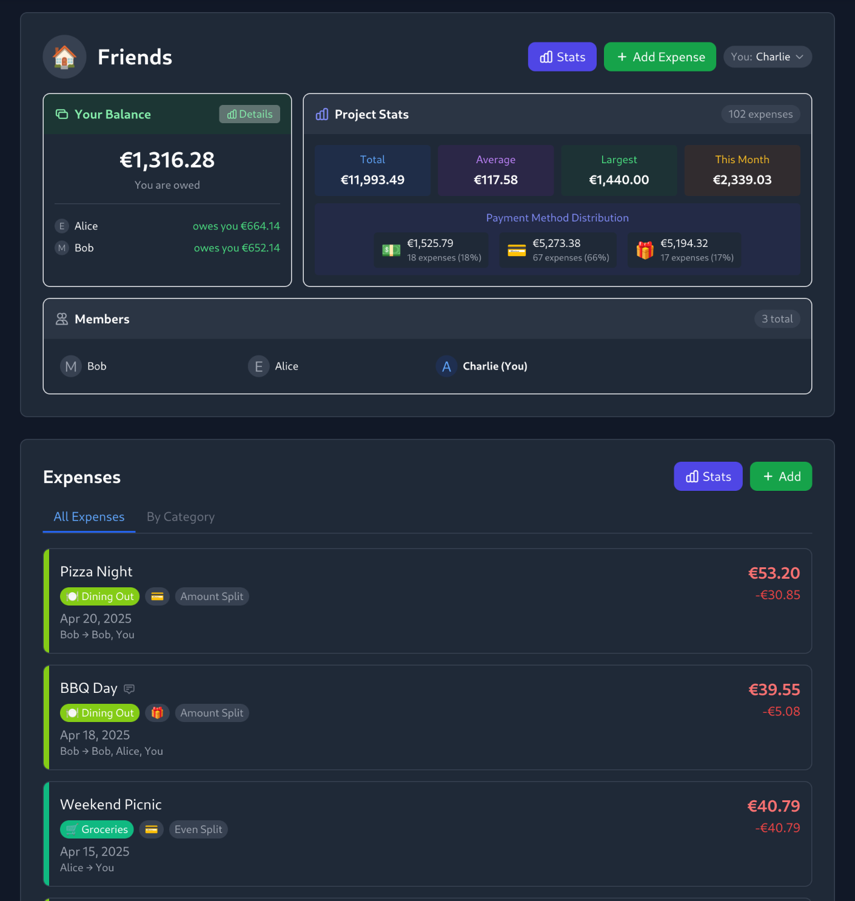
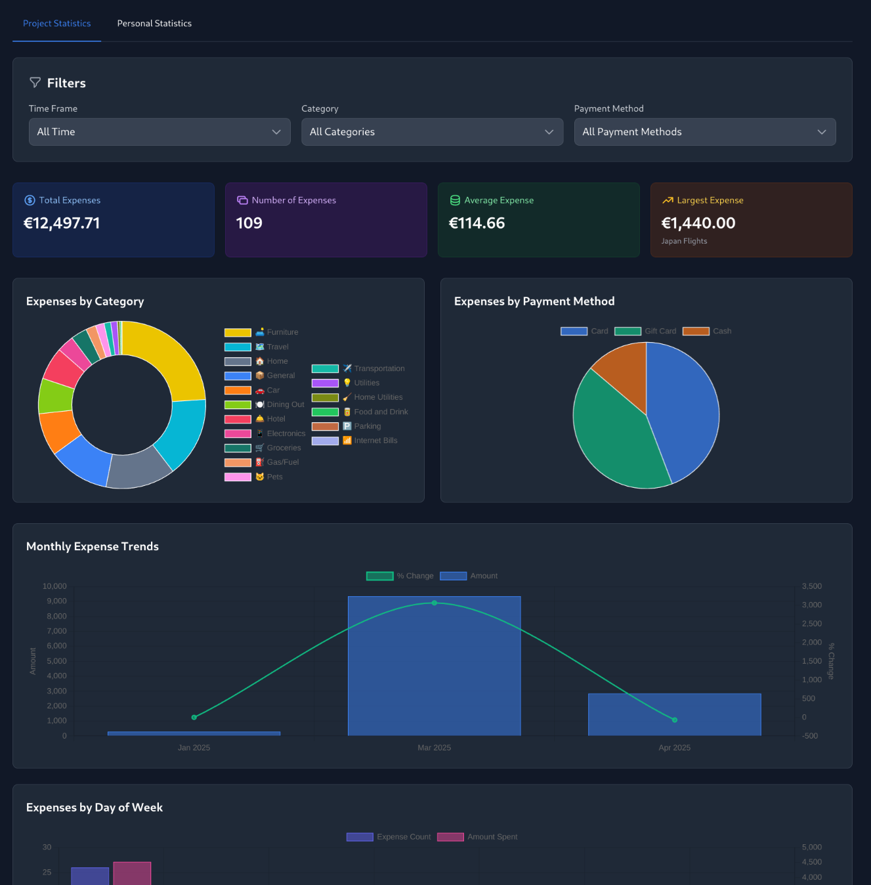
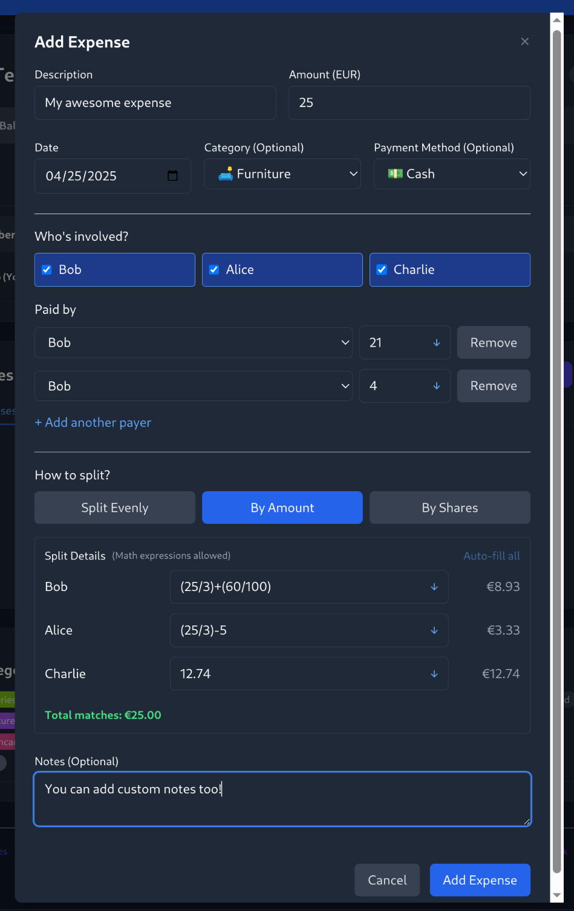

<h1 align="center">K O S T O S</h1>

<h4 align="center">💰 Expense Splitting 💰</h4>

> NOTE: This project was 100% vive coded. It was built to meet our own needs for a feature-rich, user-friendly open source expense splitting app. It works reliably for us and we use it daily, but we do not plan to refactor it. It fulfills its intended purpose as-is.

Kostos makes it easy for groups to track, manage, and split expenses together. No user registration is required. A simple interface with powerful features designed for effortless collaboration.

<h4 align="center"><a href="#screenshots">VIEW SCREENSHOTS</a> | <a href="https://kostos.shynewt.com/projects/join?projectId=oGJIl2wqOJ">DEMO</a></h4>

---

## ✨ Key Features

- **Project Management:** Create new projects or join existing ones to manage shared expenses.
- **Member Management:** Add members to projects.
- **No user accounts required:** Uses unique user and project IDs, your session is stored in your browser local storage.
- **Expense Tracking:** Record expenses with details like description, amount, date, category, and payment method.
- **Flexible Splitting:** Split expenses evenly, by specific amounts (supports basic math expressions!) or by shares.
- **Payment Tracking:** Record which member(s) paid for each expense. Support multiple payers.
- **Category Management:** Create custom categories with names and colors to organize expenses.
- **Payment Method Management:** Define and track custom payment methods with names and icons.
- **Statistics:** Visualize project expense data with beautiful charts.
- **Data Import/Export:** Functionality to import/export project data (uses Spliit format).
- **Progressive Web App (PWA):** Configured for PWA capabilities via `next-pwa`.
- **Dockerized:** Includes `Dockerfile` and `compose.yaml` for easy deployment.

## 🚀 Self Hosting

1. Get the docker compose file

   ```bash
   wget -O docker-compose.yml https://raw.githubusercontent.com/shynewt/kostos/refs/heads/main/compose.yaml
   ```

2. Run

   ```
   # The sqlite file must exist before running
   touch kostos.db && docker compose up -d
   ```

3. Open [http://localhost:3000](http://localhost:3000) in your browser

## 🧑‍💻 Development

1. **Clone the repository:**

   ```bash
   git clone <repository-url>
   cd kostos
   ```

2. **Install dependencies:**

   ```bash
   npm install
   ```

3. **Set up the database:**

   - Initialize the database schema (if starting fresh):

     ```bash
     npm run db:push
     ```

   - Alternatively, run existing migrations:

     ```bash
     npm run db:migrate
     ```

   - (Optional) Seed initial data if needed (check `scripts/init-db.js`):

     ```bash
     npm run db:init
     ```

4. **Run the development server:**

   ```bash
   npm run dev
   ```

Open [http://localhost:3000](http://localhost:3000) in your browser.

## 📜 Available Scripts

- `npm run dev`: Starts the Next.js development server.
- `npm run build`: Builds the application for production.
- `npm run start`: Starts the production server (requires `build` first).
- `npm run lint`: Runs Next.js's built-in linter.
- `npm run db:generate`: Generates SQL migration files based on schema changes using Drizzle Kit.
- `npm run db:push`: Pushes schema changes directly to the database (useful for development, potentially destructive).
- `npm run db:studio`: Opens Drizzle Studio, a GUI for interacting with the database.
- `npm run db:init`: Runs a script to potentially initialize/seed the database (see `scripts/init-db.js`).
- `npm run db:migrate`: Runs database migration scripts (see `scripts/run-migrations.js`).

## 💾 Database

This project uses Drizzle ORM to manage the SQLite database schema and queries.

- **Schema:** Defined in `db/schema.ts`.
- **Migrations:** Managed by Drizzle Kit. Generate new migrations using `npm run db:generate` after changing the schema. Apply migrations using `npm run db:migrate` (or potentially `db:push` during development).

## ⚙️ Tech Stack

- **Framework:** [Next.js](https://nextjs.org/)
- **Language:** [TypeScript](https://www.typescriptlang.org/)
- **UI Library:** [React](https://reactjs.org/)
- **Styling:** [Tailwind CSS](https://tailwindcss.com/)
- **Database:** [SQLite](https://www.sqlite.org/index.html)
- **ORM:** [Drizzle ORM](https://orm.drizzle.team/)
- **Charting:** [Chart.js](https://www.chartjs.org/) / [react-chartjs-2](https://react-chartjs-2.js.org/)
- **Date Handling:** [date-fns](https://date-fns.org/)

# Screenshots

<h5 align="center">Main Project Dashboard</h5>


<h5 align="center">Project Stats</h5>


<h5 align="center">Add Expense Form</h5>

